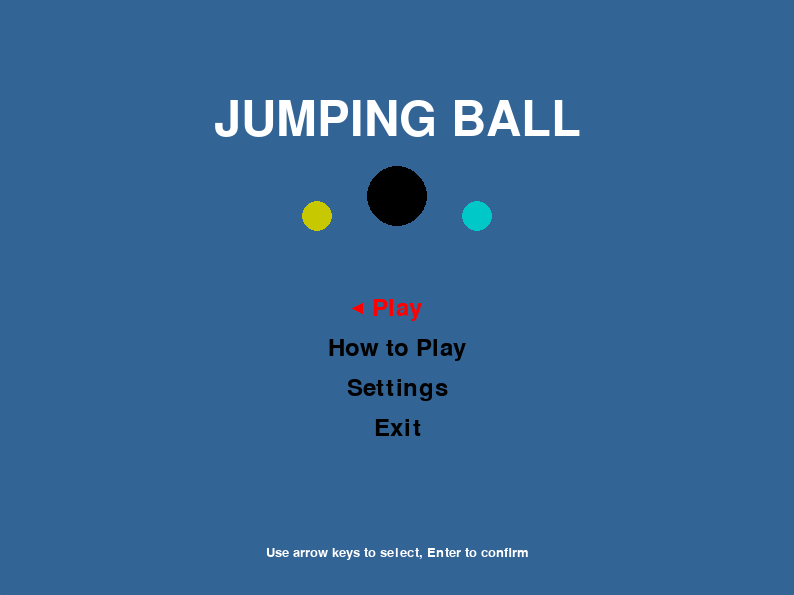
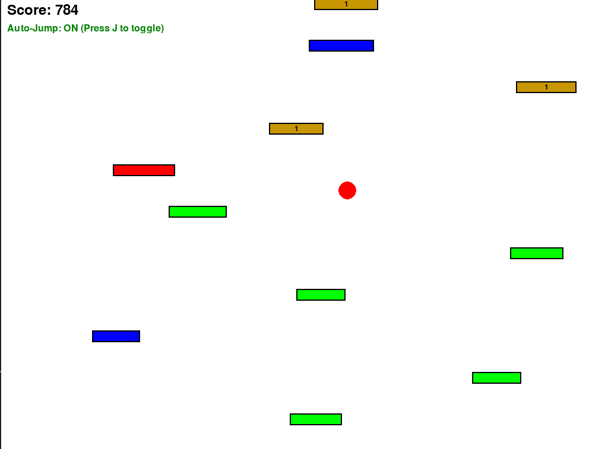
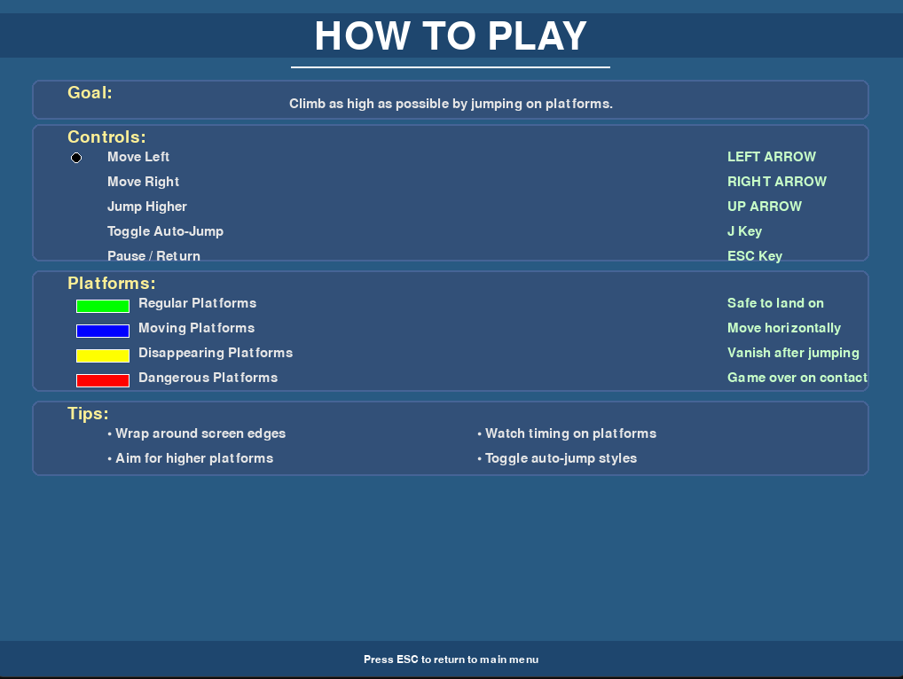
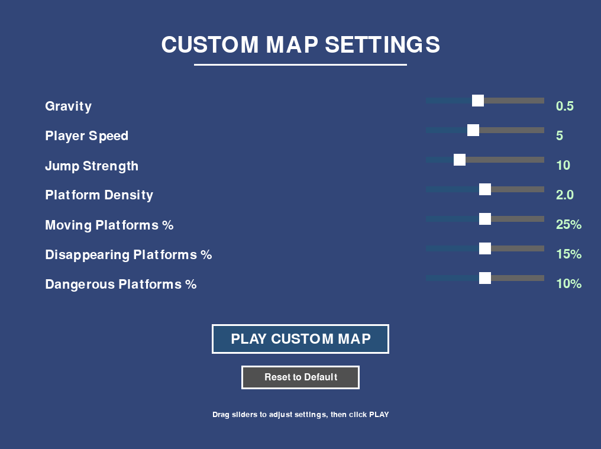
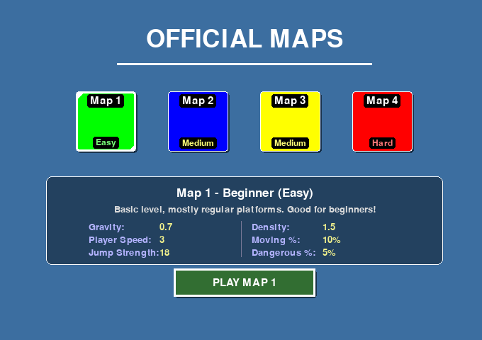
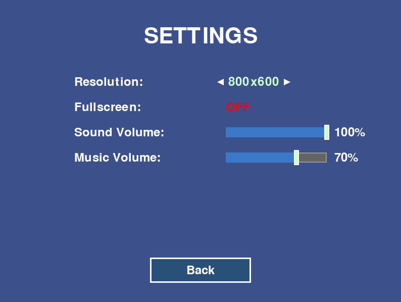

# Jumping Ball Game

## Overview
An endless platformer where a ball automatically jumps between dynamically generated platforms. Test your reflexes in this unique, minimalist arcade game.

## 🖼️ Screenshots

| Menu | Gameplay | How to Play |
|------|----------|-------------|
|  |  |  |

| Custom Map Settings | Map Varieties | Settings |
|---------------------|---------------|----------|
|  |  |  |

## 🎮 Features
- Procedural platform generation
- Automatic jumping mechanics
- Dynamic difficulty scaling
- Customizable game settings

## 📦 Installation

### Requirements
- Python 3.8+
- Pygame
- PyInstaller (for creating executable)

### Running the Game
1. Clone the repository
2. Install dependencies: `pip install -r requirements.txt`
3. Run the game: `python main.py`

### Creating Executable
```bash
pyinstaller --onefile --windowed --add-data "assets;assets" main.py
```

## 🛠️ Customization
Adjust game parameters in `src/config/` files to modify:
- Platform generation
- Difficulty
- Sound settings

## 🤝 Contributing
Contributions are welcome! Please read the contributing guidelines. 